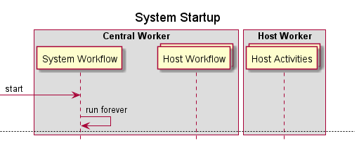
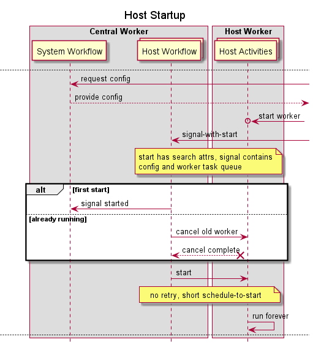
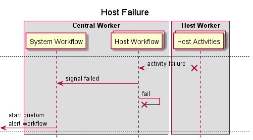
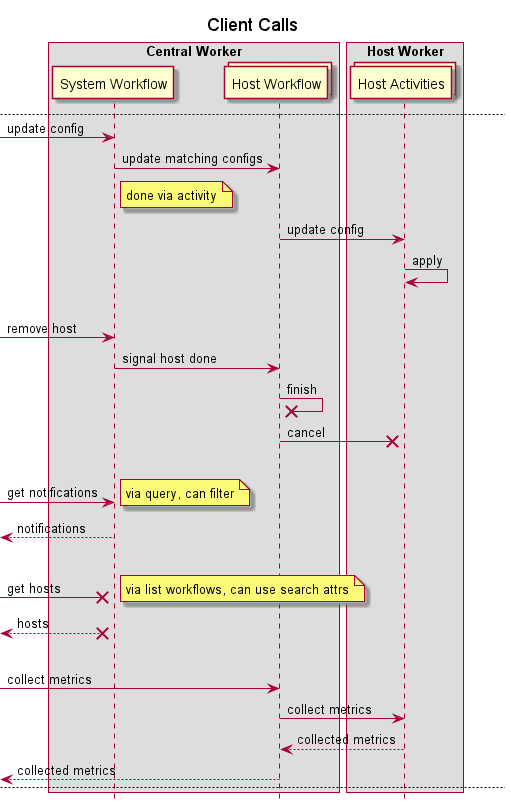
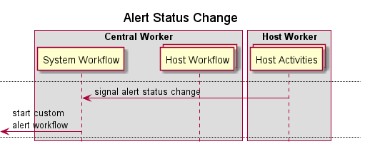
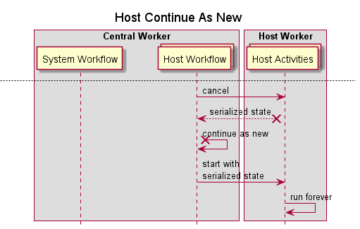

# Monitoral

Monitoral is a demonstration of a monitoring system backed by Temporal.

**⚠️ UNDER DEVELOPMENT**

The documentation herein is about the design and end-goals rather than the current state of the system.

## Sequences








## Development

### Regen protos

```
export TEMPORAL_PROTO_ROOT=$(go list -m -f '{{.Dir}}' github.com/cretz/temporal-sdk-go-advanced/temporalproto)
export GOOGLE_PROTO_ROOT=/path/to/protoc/include
protoc --go_out=paths=source_relative:. --go_temporal_out=paths=source_relative:. -I . -I $TEMPORAL_PROTO_ROOT -I $GOOGLE_PROTO_ROOT ./monitoralpb/monitoral.proto
```